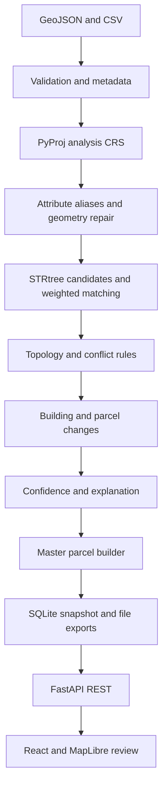

# BhoomiSync Architecture

## Problem Statement
SIH26013: Automated Integration and Intelligent Harmonization of Multi-source Geospatial Data for Urban Land Record Management. Agency parcel boundaries and attributes disagree.

## Prototype Scope
Implemented scope: local vector/CSV ingestion, projected analysis, indexed matching, explainable scoring, conflict and vector change detection, master parcels, API, map and exports. Demo-simulated scope: all input observations and ownership labels. Partial scope: safe invalid polygon repair and raster metadata. Future extensions: raster tiles, legal adjudication, distributed processing and network harmonization.

## System Architecture

## Backend Modules
`services/ingestion.py` validates files and metadata; `crs.py` selects UTM and caches transforms; `attributes.py` maps aliases; `matching.py` indexes candidates and measures geometry; `topology.py` repairs and detects overlaps; `changes.py` compares building epochs; `pipeline.py` orchestrates evidence, master records and conflicts; `storage/repository.py` persists snapshots; `api/routes.py` exposes results and runs.

## Frontend Modules
React navigation, backend summary, source metadata, actual stage progress, MapView layer controls and picking, ParcelDetails evidence, filtered conflicts and export links.

## Data Flow
Original files remain immutable. Analysis uses projected metres; display and exports use WGS84. Cadastral geometry remains the master geometry; municipal observations supply evidence, never an unreviewed boundary replacement. Original invalid observations and repair operations remain in provenance.

## Canonical Parcel Model
Identifiers, owner/land use, calculated area/perimeter, source IDs, metrics, confidence, status, conflicts, changes, review decision and provenance. Missing observations are null.

## Matching Algorithm
Buffered STRtree search, polygon IoU, centroid proximity, area ratio, Hausdorff boundary similarity and normalized survey/owner similarity. Greedy global score ordering enforces one-to-one municipal assignment. Ambiguous candidates require review.

## Confidence Model
Configurable weights .45/.20/.15/.10/.10, renormalized over available signals. Explicit evidence penalties reduce scores for missing records and serious issues. Score is a heuristic evidence index, not a calibrated accuracy probability.

## Conflict Classification
Boundary, area, attribute, invalid topology, overlap, unmatched source, ambiguity and GNSS deviations. Changes are separate records. Severe issues force review regardless of score.

## Demo Mode
Six generated source files near Bengaluru. Fixtures define coordinates and controlled disagreements, never final metric values. Reset regenerates inputs and clears cached results; rerun executes real processing. No external service required.

## Storage
Repository interface with SQLite JSON snapshots, raw/demo files and generated export artifacts. Single local worker; production migration needs transactional run tables and durable worker queues.

## API Boundaries
Health/datasets, demo load/reset, asynchronous run/status, summaries/parcels/conflicts/changes, WGS84 layers, restricted export filenames. See API_CONTRACT.md.

## Reused Components
Concepts adapted from Bengaluru-UrbanScope map/persistence, kv overlay controls, Landroid Transformer/raster/Pydantic patterns. No copied source code. See SOURCE_AUDIT.md and MIGRATION_MAP.md.

## Production Evolution
PostGIS repository, GeoServer or OGC APIs, durable workers, object storage and authorized DoLR/CORS feeds can replace local adapters. They are not prerequisites or implemented dependencies.

## Structure Deviations
Related small functions share focused service files rather than dozens of boilerplate directories. API routes share a router. Shapely/PyProj and stdlib CSV replace GeoPandas/Pandas to reduce Windows installation cost. Raster tiles are deferred.
